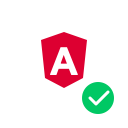
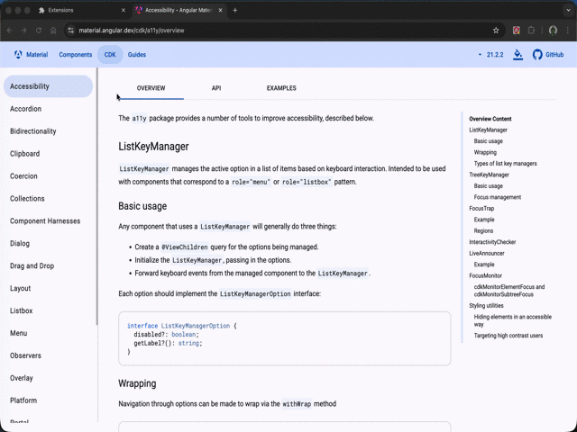

<p align="center">
  
</p>

# Angular Highlight

A Chrome extension that highlights Angular components when change detection runs — just like React DevTools' "Highlight updates when components render".



## Features

- **Real-time visualization** — Components flash green whenever Angular's change detection runs
- **Zone.js support** — Works with Angular v2+ apps using Zone.js (Angular 2–18)
- **Zoneless / Signals support** — Works with Angular v16+ Signals and Zoneless apps (v18+)
- **Performance-safe** — Throttled to avoid impacting the page itself
- **One-click toggle** — Enable or disable from the popup
- **AI diagnosis (optional, beta)** — Ask [Jev](https://typesafe.ai) whether a component re-renders excessively, why, and how urgent it is (OFF by default)

## How It Works

| Angular mode | Detection method |
|---|---|
| Zone.js (v2–v18) | Patches `Zone.prototype.runTask` to catch when Angular's zone completes a task |
| Zoneless / Signals (v16+) | Uses `MutationObserver` to detect DOM changes and traces back to the nearest Angular component |

Angular Ivy (v9+) marks every component host element with `__ngContext__`, which is used to identify component boundaries.

## AI Diagnosis (optional, beta)

When a component re-renders many times in a short period, the extension can ask [Jev](https://typesafe.ai) (a judgment-focused AI model by TypeSafe AI) whether it is excessive, what the likely cause is, and how urgent it is. The result is shown as a red badge above the component; click the badge to dismiss it.

**It is OFF by default.** Nothing is sent until you enter your own TypeSafe API key in the popup and turn the toggle ON.

### What you get

| Item | Values |
|---|---|
| Excessive? | Probability (e.g. `60%`) — the badge is shown only when it is 50% or higher |
| Likely cause | OnPush not used / re-rendered along with its parent / functions or objects recreated on every render / undetermined |
| Priority | Low / Medium / High |

### When is a component diagnosed?

- A component is diagnosed when it re-renders **N times within 2 seconds**. N defaults to **10** and can be changed in the popup (3–13).
- **The default of 10 is a rule of thumb, not a statistically derived value.** Lower it to be more sensitive, raise it to reduce noise.
- **The maximum is 13 (a rule of thumb).** Zone.js-based detection records at most once per 150ms, so higher values are less likely to trigger.
- **Each component is diagnosed once per page load.** Reload the page to diagnose it again. This keeps the number of (billable) API requests small.
- Zone.js detection only knows that a change detection cycle ran, not that the DOM actually changed, so the re-render count is an approximation.

### Data and security

- Sent to the Jev API (only while enabled): component name, change detection strategy (OnPush / Default), re-render count, detection method, and parent component name. **Page content, URLs, and user input are never sent.**
- Your API key is stored in `chrome.storage.local` and used only by the extension's background service worker (`background.js`). It is never exposed to the page (`inject.js`).
- The only host the extension talks to is `https://api.typesafe.ai/*`.
- See the full [Privacy Policy](./PRIVACY.md).

### Setup

1. Get an API key at [console.typesafe.ai](https://console.typesafe.ai)
2. Open the popup, paste the key into **AI Diagnosis (Jev)**, and turn the toggle ON
3. Reload the Angular page

## Installation

### From Chrome Web Store

[Angular Highlight - Chrome Web Store](https://chromewebstore.google.com/detail/angular-highlight/infobgaghdedlmbmedgmknemgkeomojp?hl=ja)

### Load unpacked (for development)

1. Clone this repository
   ```bash
   git clone https://github.com/ksakae1216/angular-highlight.git
   ```
2. Open `chrome://extensions/`
3. Enable **Developer mode** (top right)
4. Click **Load unpacked** and select the cloned folder

## Usage

1. Open any Angular app (e.g., [material.angular.dev](https://material.angular.dev))
2. Click the Angular Highlight icon in the toolbar
3. Toggle **ON** — green borders will flash on components as they re-render
4. Toggle **OFF** to stop highlighting

## Compatibility

| Angular version | Zone.js | Signals | Status |
|---|---|---|---|
| v2 – v15 | ✅ | — | ✅ Supported |
| v16 – v17 | ✅ | ✅ (hybrid) | ✅ Supported |
| v18+ (Zoneless) | — | ✅ | ✅ Supported |

> **Note:** Component detection relies on `__ngContext__`, which is present in both development and production builds with Angular Ivy (v9+).

## License

MIT
